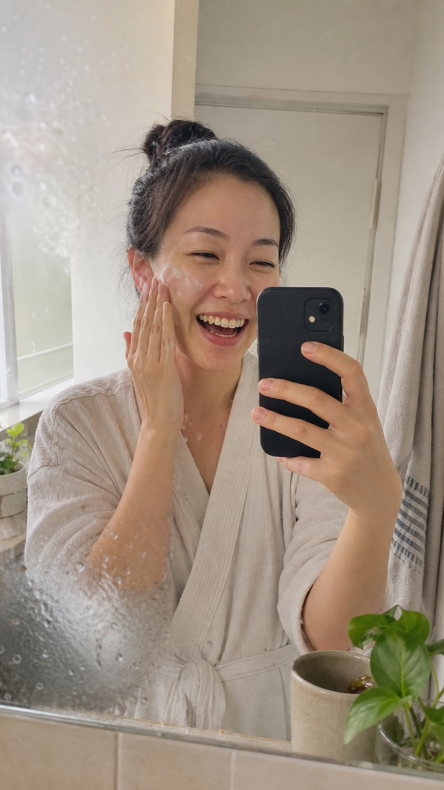
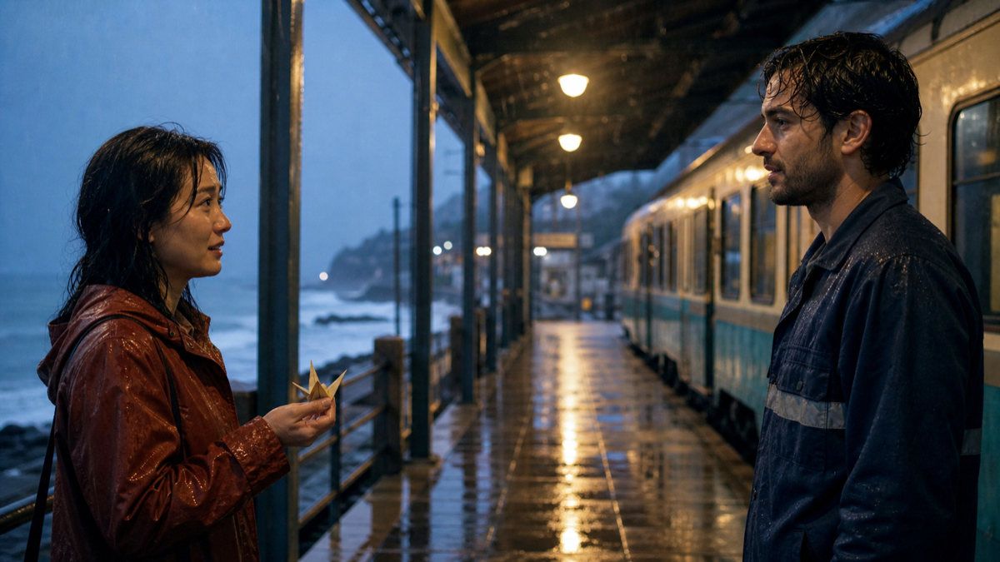
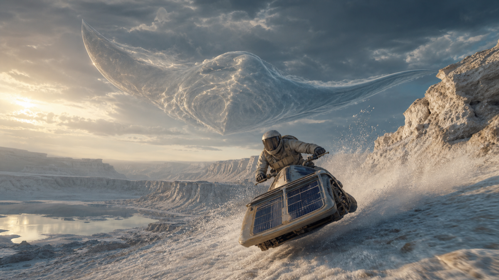

<div align="center">


# Awesome Kling 4.0 Prompts

### 40 original, production-ready Kling AI video prompt recipes with 15-language project guides

[](https://awesome.re)
[](LICENSE)
[](prompts/README.md)
[](#full-prompt-library)
[](docs/LANGUAGES.md)
[](#model-status-and-compatibility)
[](https://github.com/flaqai/awesome-kling-4-0/pulls)

**English** · [简体中文](README.zh-CN.md) · [繁體中文](README.zh-TW.md) · [日本語](README.ja-JP.md) · [한국어](README.ko-KR.md) · [Español](README.es-ES.md) · [Français](README.fr-FR.md) · [Deutsch](README.de-DE.md) · [All 15 languages](docs/LANGUAGES.md)

| [Browse 40 prompts](prompts/README.md) | [Submit an original prompt](https://github.com/flaqai/awesome-kling-4-0/issues/new?template=prompt.yml) | [Request a missing scenario](https://github.com/flaqai/awesome-kling-4-0/issues/new?template=request.yml) | [Contribution guide](CONTRIBUTING.md) | [Create with FLAQ.AI](#about-flaqai) |
|---|---|---|---|---|

</div>

> [!IMPORTANT]
> **Model status — 26 August 2026:** Kuaishou has not officially announced a Kling 4.0 model or API. The latest verified major release is **Kling AI 3.0**, launched on 5 February 2026. Kuaishou reported native 4K output for the 3.0 series on 19 August 2026. “Kling 4.0” in this repository is a forward-looking community project name, not a claim that 4.0 has been released.

An original, production-oriented library of complete Kling AI video prompts for **text-to-video, image-to-video, start/end frames, element references, multi-shot direction, native audio, motion transfer, video editing and extension**. Use copy-ready recipes for cinematic stories, product ads, livestream commerce, UGC, multilingual dialogue, automotive, industrial, VFX, animation, games, pets, education, green-screen plates, previsualization and social video.

## Find the right prompt in under a minute

| If you need… | Start here |
|---|---|
| One complete prompt to customize | [40-prompt master index](prompts/README.md) |
| Film dialogue or emotional performance | [Cinematic & dialogue prompts](prompts/cinematic-and-dialogue.md) |
| Product, e-commerce, UGC or local-business content | [Commercial & UGC prompts](prompts/commercial-and-ugc.md) |
| Sports movement, pursuit, transformation or spectacle | [Action & VFX prompts](prompts/action-and-vfx.md) |
| Animation, fashion, music or dance | [Style & performance prompts](prompts/style-and-performance.md) |
| Food, travel, architecture or craft | [Food, travel & spaces prompts](prompts/food-travel-spaces.md) |
| Education, documentary, loops or social impact | [Education, documentary & social prompts](prompts/education-documentary-social.md) |
| Match cuts, multi-reference, motion transfer or video revision | [Reference, editing & control prompts](prompts/reference-editing-and-control.md) |
| Livestream, gadgets, automotive or manufacturing | [Commerce, tech, mobility & industrial prompts](prompts/commerce-tech-mobility-industrial.md) |
| Presenters, digital humans, pets or supervised learning | [People, pets, learning & culture prompts](prompts/people-pets-learning-culture.md) |
| Games, astronomy, green screen or previsualization | [Gaming, nature & production-tool prompts](prompts/gaming-nature-and-production-tools.md) |
| Better timing, camera, continuity, audio or constraints | [Advanced prompting guide](docs/PROMPT-GUIDE.md) |
| Dialogue, pronunciation and mixed-language scenes | [Multilingual audio guide](docs/MULTILINGUAL-AUDIO.md) |
| Guidance in another language | [15-language directory](docs/LANGUAGES.md) |
| Browser testing or an API-oriented workflow | [FLAQ.AI workflow guide](docs/FLAQ-AI.md) |

## What is included

- **40 complete prompts, not one-line fragments:** each includes mode, anchors, world geometry, timed direction, performance, sound and failure constraints.
- **Ten production collections:** film, dialogue, reference control, editing, product, livestream, UGC, automotive, industrial, action, VFX, animation, fashion, performance, food, travel, spaces, learning, pets, games and reusable production plates.
- **Four control strategies:** text-led discovery, image-to-video, start/end-frame transitions and element/reference consistency.
- **Five verified native-dialogue languages:** Chinese, English, Japanese, Korean and Spanish, including mixed-language examples.
- **15 project languages:** localized navigation and quick-start guidance, with a transparent distinction between documentation and model speech support.
- **Five original visual assets:** every local image was generated for this repository and documented in the [asset manifest](assets/images/README.md).
- **Production guidance:** aspect-ratio planning, camera geography, reference ownership, audio timelines, iteration logs, rights review and pre-publish checks.
- **FLAQ.AI workflow notes:** browser and API routes for currently available Kling 3.0 text-to-video and image-to-video models.

## Model status and compatibility

This table separates official facts, live-platform availability and future-facing project naming.

| Item | Verified status | Repository policy |
|---|---|---|
| Kling 4.0 | **Not officially announced** as of 2026-08-26 | No invented price, duration, model ID or API schema |
| Latest official generation | **Kling AI 3.0 series** | Used as the technical baseline |
| Maximum Video 3.0 duration | Up to **15 seconds** | Prompt timelines stay within 5–15 seconds |
| Kling 3.0 video output | Official guide lists 720p/1080p modes; Kuaishou reported **native 4K rollout** on 2026-08-19 | Record the model, provider, mode and date used; availability may vary |
| Multi-shot | Automatic and custom multi-shot documented | Shots declare time, frame, action and camera path |
| Identity / element consistency | Start frame + bound subject / element reference documented | Named continuity anchors are repeated across shots |
| Native audio | Dialogue, ambience and effects | Audio is assigned per speaker and timed beat |
| Verified dialogue languages | Chinese, English, Japanese, Korean and Spanish | Other project languages are not presented as native-audio support |
| 3+ character dialogue | Multi-character coreference documented | Group scenes fix speaker, seat, wardrobe and order |
| Text preservation | Improved preservation of source-image text documented | Approved packaging should be supplied as a reference and checked frame by frame |
| FLAQ.AI availability | Kling 3.0 Standard text-to-video and image-to-video pages are live | This repository does not claim Kling 4.0 availability on FLAQ.AI |

Verified sources: [Kuaishou’s Kling AI 3.0 announcement](https://ir.kuaishou.com/news-releases/news-release-details/kling-ai-launches-30-model-ushering-era-where-everyone-can-be), the [official Kling Video 3.0 guide](https://app.klingai.com/cn/quickstart/klingai-video-3-model-user-guide), [Kuaishou’s 19 August 2026 results update](https://ir.kuaishou.com/news-releases/news-release-details/kuaishou-technology-announces-second-quarter-and-interim-2026), and the live FLAQ.AI pages linked in the [FLAQ.AI workflow guide](docs/FLAQ-AI.md).

## What makes a strong Kling video prompt?

A useful prompt reads like a compact directing brief, not a pile of visual adjectives.

```text
[OUTPUT]
Duration, aspect ratio, single take or multi-shot, intended finish.

[REFERENCE ROLES]
Image 1 locks identity; Image 2 locks product geometry; a motion reference supplies movement only.

[CONTINUITY ANCHORS]
Named subject, stable face/hair/silhouette/wardrobe; fixed product or prop shape/material/color.

[WORLD]
Location, time, weather, practical light sources and starting positions.

[TIMED SHOTS]
0–{x}s — frame size, angle and camera path; one primary action; physical response.
{x}–{y}s — next beat; one primary action; payoff and deliberate final frame.

[PERFORMANCE AND PHYSICS]
Gaze, breathing, hands, weight, inertia, contact, cloth, liquid and environmental reaction.

[AUDIO]
Named speaker, exact line, language, tone, ambience, synchronized foley and music entry/exit.

[CONTINUITY / AVOID]
What must never change; no identity drift, duplicates, fake text, logos or watermarks.
```

Read [Kling Video Prompt Engineering](docs/PROMPT-GUIDE.md) for the complete method and iteration ladder.

## Four copy-ready highlights

### Premium botanical drink reveal


Stable packaging geometry, macro condensation, controlled vapor, an orbit with a fixed endpoint and three synchronized sound events.

**Mode:** product reference + start image · **Format:** 9s, 16:9 · [Copy the complete prompt →](prompts/commercial-and-ugc.md#1-botanical-spark-product-reveal)

### Authentic morning skincare UGC



Handheld smartphone realism, natural skin texture, one credible product interaction and claim-safe conversational language.

**Mode:** image-to-video, single take · **Format:** 12s, 9:16 · [Copy the complete prompt →](prompts/commercial-and-ugc.md#3-morning-skincare-ugc-one-take)

### Multilingual station reunion



Korean–Spanish speaker assignment, two character anchors, matched eyelines and continuous rain ambience.

**Mode:** two character references + custom multi-shot · **Format:** 15s, 16:9 · [Copy the complete prompt →](prompts/cinematic-and-dialogue.md#2-the-paper-crane-at-platform-seven)

### Glass-manta salt-canyon pursuit



Separate vehicle, camera, dust and creature trajectories for readable action geography and physically delayed environmental response.

**Mode:** start image + custom multi-shot · **Format:** 12s, 16:9 or 21:9 · [Copy the complete prompt →](prompts/action-and-vfx.md#1-the-glass-manta-pursuit)

## Full prompt library

| Collection | Practical coverage | Prompts |
|---|---|---:|
| [Cinematic & dialogue](prompts/cinematic-and-dialogue.md) | short film, multilingual reunion, micro-performance, three-person comedy | 4 |
| [Commercial & UGC](prompts/commercial-and-ugc.md) | beverage, feature demo, skincare UGC, neighborhood business | 4 |
| [Action & VFX](prompts/action-and-vfx.md) | pursuit, climbing, material transformation, miniature weather | 4 |
| [Style & performance](prompts/style-and-performance.md) | original animation, fashion, live music, dance motion | 4 |
| [Food, travel & spaces](prompts/food-travel-spaces.md) | food ASMR, destination film, hotel/real estate, craft process | 4 |
| [Education, documentary & social](prompts/education-documentary-social.md) | explainer, nature film, seamless meme loop, public-interest story | 4 |
| [Reference, editing & control](prompts/reference-editing-and-control.md) | match cut, multi-image continuity, motion transfer, video revision | 4 |
| [Commerce, tech, mobility & industrial](prompts/commerce-tech-mobility-industrial.md) | livestream, gadget assembly, automotive, manufacturing | 4 |
| [People, pets, learning & culture](prompts/people-pets-learning-culture.md) | talking head, digital human, animal profile, supervised science | 4 |
| [Gaming, nature & production tools](prompts/gaming-nature-and-production-tools.md) | game cinematic, astronomy, compositing plate, white-model previs | 4 |

The [master index](prompts/README.md) also filters prompts by goal and recommended input strategy.

## Language and localization

The project now has guides in **15 languages**:

- English, Simplified Chinese, Traditional Chinese, Japanese and Korean;
- Spanish, French, German, Brazilian Portuguese and Italian;
- Arabic, Russian, Bahasa Indonesia, Thai and Vietnamese.

The canonical prompt files remain in English so complex timings and camera instructions do not silently diverge. Localized guides provide a translated quick template, model-status warning, FLAQ.AI overview and stable links to the same prompt IDs. See the [language matrix and localization rules](docs/LANGUAGES.md).

> Documentation language ≠ native speech support. The verified Kling 3.0 native-dialogue list contains Chinese, English, Japanese, Korean and Spanish. For other spoken languages, test the live model or add reviewed voice-over in post-production.

## Image-to-video checklist

- Lock identity, wardrobe, product shape, object count, composition and key-light direction.
- Give each reference one job; do not ask all references to control everything.
- Separate subject motion, environmental motion and camera motion.
- Describe the camera’s start, path, speed and final stopping point.
- Preserve hand contact, weight, inertia, reflections and shadows.
- Reserve the final one or two seconds for deceleration and a usable final frame.
- Add dialogue, ambience, foley and music as separate audio layers.
- Use original or licensed people, products, music, footage and locations.

## Kling prompt FAQ

### What is a Kling video prompt?

A strong Kling prompt is a short directing brief. It defines the output, reference roles, continuity anchors, world geometry, timed action, camera path, performance, physics, sound and concrete failure conditions.

### Should I use text-to-video or image-to-video?

Use text-to-video for visual discovery from a concept or script. Use image-to-video when a product, person, illustration, composition or first frame must remain recognizable. Use start/end frames when the destination matters as much as the opening.

### How do I keep a person or product consistent?

Create one primary anchor, list its invariant properties before motion, bind the matching reference where available, and explicitly reject redesign, part-count changes, label drift and identity drift. Test the anchor before adding complex effects.

### Can prompts be written in different languages?

Yes. This project provides 15-language quick-start guidance. Verified Kling 3.0 native dialogue is documented for Chinese, English, Japanese, Korean and Spanish. Keep language, speaker, tone and line ownership explicit, then verify pronunciation and wording.

### Are the prompts free to use?

The repository is released under the [MIT License](LICENSE). Generated output can still involve separate rights for people, voices, music, trademarks, source images, locations, claims and the model platform used.

### Is Kling 4.0 available now?

No official Kuaishou announcement or API specification was found as of 2026-08-26. The latest verified major release is Kling AI 3.0. This repository is prepared for a future official 4.0 release without presenting predictions as facts.

## Sources, originality and responsible use

- [Official Kling AI 3.0 announcement](https://ir.kuaishou.com/news-releases/news-release-details/kling-ai-launches-30-model-ushering-era-where-everyone-can-be)
- [Official Kling Video 3.0 user guide](https://app.klingai.com/cn/quickstart/klingai-video-3-model-user-guide)
- [Kuaishou Q2 2026 update announcing Kling 3.0 native 4K rollout](https://ir.kuaishou.com/news-releases/news-release-details/kuaishou-technology-announces-second-quarter-and-interim-2026)
- [Original image prompt and provenance notes](assets/images/README.md)
- [Curation, inspiration and originality policy](docs/CURATION.md)
- [FLAQ.AI model and API workflow](docs/FLAQ-AI.md)

All prompts, scenarios, descriptions and local images in this repository were newly created for this collection. The examples avoid celebrity likenesses, third-party brand slogans and protected fictional characters. Review output for copyright, likeness, trademark, audio, safety, factual accuracy, accessibility and platform-policy compliance before commercial use.

## About FLAQ.AI

[FLAQ.AI](https://flaq.ai/) is a browser-based platform and unified API layer for image, video and language-model workflows. Its current catalog lets creators and developers discover models, run browser experiments and move validated ideas into API-oriented production.

| Your starting point | FLAQ.AI route | Typical use |
|---|---|---|
| Concept, script or shot list | [Kling 3.0 Standard Text-to-Video](https://flaq.ai/models/kuaishou/kling-3-0-std-text-to-video/) | Concept films, social hooks, narrative shots and previsualization |
| Product image, portrait, illustration or first frame | [Kling 3.0 Standard Image-to-Video](https://flaq.ai/models/kuaishou/kling-3-0-std-image-to-video/) | Product animation, identity-led portraits and controlled composition |
| Repeatable application or automation | [FLAQ.AI API documentation](https://flaq.ai/docs/) | Creative tools, batch workflows and production integrations |

FLAQ.AI currently lists Kling 3.0 workflows; this repository does **not** claim Kling 4.0 availability there. Live model names, controls, pricing, duration, resolution and API schemas can change, so check the current page before production. See [Creating Kling Videos with FLAQ.AI](docs/FLAQ-AI.md) for a transparent workflow and rights checklist.

## Contributing

Original prompt recipes, reproducible tests, accessibility improvements, careful translations and verified capability updates are welcome.

1. **Fastest route:** [open the prompt form](https://github.com/flaqai/awesome-kling-4-0/issues/new?template=prompt.yml), choose a category and paste a complete original recipe.
2. **Need a prompt that is missing?** [Request a scenario](https://github.com/flaqai/awesome-kling-4-0/issues/new?template=request.yml) with the goal, inputs and hardest failure to solve.
3. **Ready to edit the library?** Open a focused pull request using the exact entry format in [CONTRIBUTING.md](CONTRIBUTING.md).

Submissions may be marked **recipe-only**, **community-tested** or **source-verified**. A preview is welcome but not required; never upload media you cannot license. New prompts must be independently written—the project accepts scenario inspiration, not copied prose, characters, shot sequences, thumbnails or promotional metadata.

## License

Code, documentation and original prompt text are released under the [MIT License](LICENSE). Generated media remains subject to the terms of the generation tool. “Kling” and “FLAQ.AI” are trademarks of their respective owners; use here is descriptive.

---

<div align="center">

**Kling 4.0 prompts · Kling AI prompts · AI video prompt engineering · Kling API workflows · image-to-video · reference-to-video · video editing · livestream commerce · automotive video · industrial video · green-screen plates · cinematic prompts · product video · UGC · multilingual AI video**

If this library saves you a production test, consider starring the repository and contributing a documented result.

</div>
